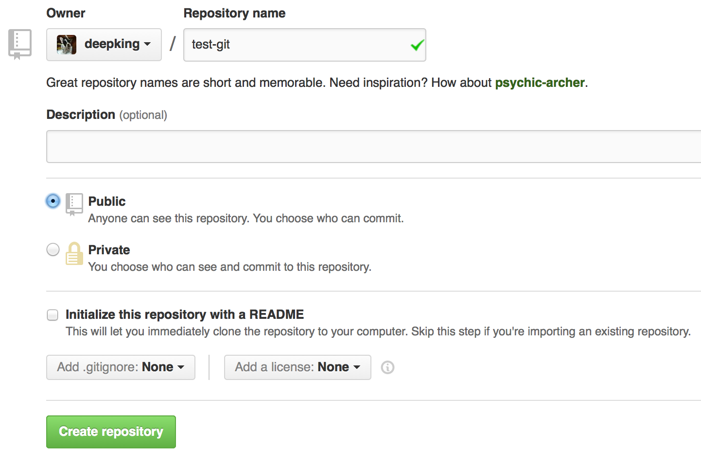
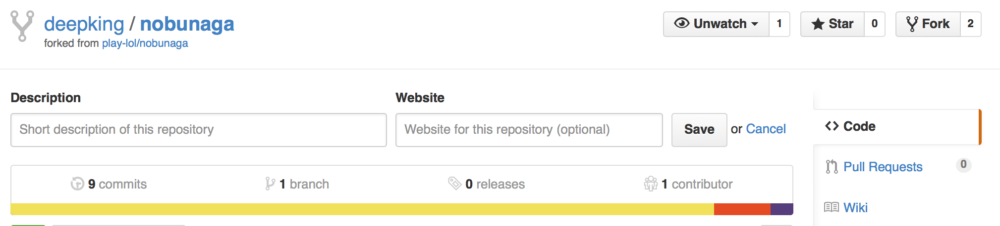
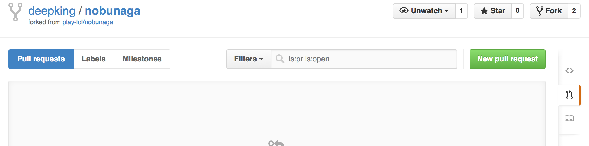
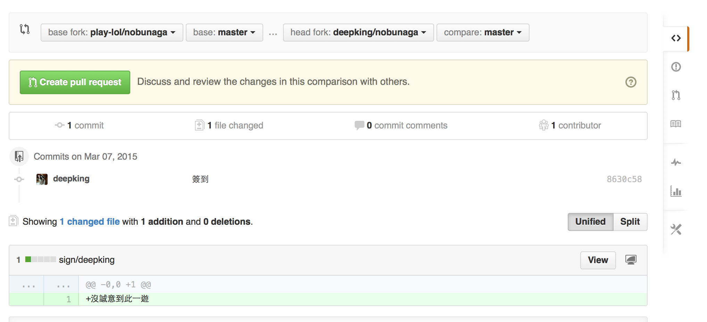
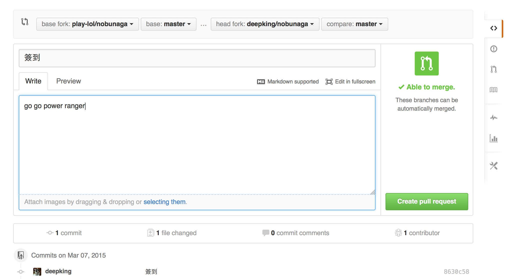
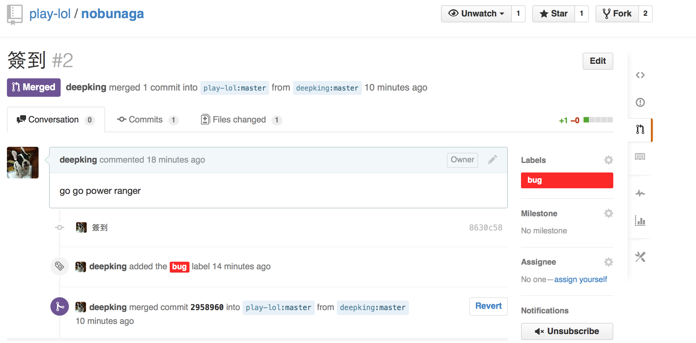

# Git

把某個 Folder 當作一個 Repository(Repo)，裡面有個 .git/ 用來記錄這個 
Repo 的檔案被修改的歷史記錄，經由 Commit 將目前的狀態跟 .git/ 記錄比較，
產生 Diff（與上一次存檔的差異），並且存入 .git/ 。

透過 Clone 複製一份現有的 Repo Foo 到另一個 Repo Bar，同時在兩個 Repo 
修改檔案，透過 Merge 同步兩個 Repo 的檔案。

Git 允許多個 Repo 存在，各個 Repo 同時被修改再 Merge 同步資料。

Github 是存放一份 Repo 在 Server，每個 Github User Fork 一份 Repo，
修改之後在跟原本的 Repo 同步。

# Resource
- [the simple guide](http://rogerdudler.github.io/git-guide/)

# Create Repo
新增且進入目錄，執行
```
$ git init
```

Example
```
$ mkdir foo
$ cd foo
$ git init
$ ls -a
.  ..  .git
```
ls 可以看到 .git/ 目錄被建立

# 設定
修改之後被記錄在 .git/config , 可以直接修改 .git/config 刪掉不要的
config

## User & Email
每個 Comiit 會記錄作者 Name 跟 E-Mail, 可以透過以下 Command 修改
```
$ git config user.name YourName
$ git config user.email Your@Email
```
## highlight
use colorful git output
```
$ git config color.ui true
```
show log on just one line per commit
```
$ git config format.pretty oneline
```

## editor
### Sublime Text 2
```
git config --global core.editor "'c:/program files/sublime text 2/sublime_text.exe' -w"
```

### Sublime Text 3
```
git config --global core.editor "'c:/program files/sublime text 3/subl.exe' -w"
```


# Add & Commit


[圖片來源](http://rogerdudler.github.io/git-guide/)

新增一個檔案 a.txt, 看目前狀態
```
$ touch a.txt
$ git status
On branch master

Initial commit

Untracked files:
  (use "git add <file>..." to include in what will be committed)

	a.txt

nothing added to commit but untracked files present (use "git add" to track)
```
Untracked files 表示不在 Commit 範圍內，並不會被 Commit。

透過 add 加到 stage，stage 表示在 commit 範圍的 file 更動
```
$ git add a.txt
$ git status 
On branch master

Initial commit

Changes to be committed:
  (use "git rm --cached <file>..." to unstage)

	new file:   a.txt
```

commit 記錄
```
$ git commit -m "init"
[master (root-commit) 41e0e9f] init
 1 file changed, 0 insertions(+), 0 deletions(-)
 create mode 100644 a.txt

$ git log
41e0e9f0214933600cedd351fbb7d3a49eab3fde init
```
41e0e9 是這個 commit 的 unique id


修改 a.txt 再 commit 

a.txt:
```
line 1
line 2
```
add & commit
```
$ git add a.txt
$ git commit -m "update a.txt"
$ git log
b2a1931a190d38dc1051226418f073141b9d588d update a.txt
41e0e9f0214933600cedd351fbb7d3a49eab3fde init
```
這時有兩個記錄，41e0e, b2a19

# Diff
看這兩個 commit 的 diff(差異), + 是新增, -是減少
```
$ git diff 41e0e b2a19
diff --git a/a.txt b/a.txt
index e69de29..7bba8c8 100644
--- a/a.txt
+++ b/a.txt
@@ -0,0 +1,2 @@
+line 1
+line 2

$ git diff b2a19 41e0e
diff --git a/a.txt b/a.txt
index 7bba8c8..e69de29 100644
--- a/a.txt
+++ b/a.txt
@@ -1,2 +0,0 @@
-line 1
-line 2
```

# Branch

再修改 a.txt 並 commit
```
line 1
line 2
line 3
```

```
$ git add a.txt
$ git commit -m "append line3"
$ git log
6af315c02575ecd95cdb5010eb0947c05cd34e42 append line 3
b2a1931a190d38dc1051226418f073141b9d588d update a.txt
41e0e9f0214933600cedd351fbb7d3a49eab3fde init
```
突然覺得 line3 不太好，想改好一點的寫法，又不想直接丟掉 line3,
這時可以退回第2個 Commit，開一個 Branch 寫新的 Code
```
$ git checkout -b experiment b2a1931
Switched to a new branch 'experiment'

$ git log --graph --oneline --decorate --all
* 6af315c (master) append line 3
* b2a1931 (HEAD, experiment) update a.txt
* 41e0e9f init

$ cat a.txt
line 1
line 2
```
可以看到目前 HEAD  在 branch experiment, a.txt 的內容是還沒有 line 3 


修改 a.txt 再 commit
```
line 1
line 2
new line 3
```
commit
```
$ git add a.txt
$ git commit -m "new line 3"
[experiment 01f7130] new line 3
 1 file changed, 1 insertion(+)

$ git log --graph --oneline --decorate --all
* 01f7130 (HEAD, experiment) new line 3
| * 6af315c (master) append line 3
|/  
* b2a1931 update a.txt
* 41e0e9f init
```
切換到 master
```
$ git checkout master
Switched to branch 'master'
```

把 experiment branch, merge 到 master
```
$ git merge experiment
Auto-merging a.txt
CONFLICT (content): Merge conflict in a.txt
Automatic merge failed; fix conflicts and then commit the result.

$ cat a.txt
line 1
line 2
<<<<<<< HEAD
line 3
=======
new line 3
>>>>>>> experiment
```
git 發現 line 3 有 Conflict, 需要你手動 merger, 改成你想要的內容,
editor 通常有 plugin 提供比較好看的畫面讓你方便執行 merger
```
line 1
line 2
new line 3
```
修改之後，必須 add, 然後 commit
```
$ git add a.txt
$ git commit
```
會出現以下 message 到 editor, 可以修改 message 或者直接存檔
```
Merge branch 'experiment'                                                       

# Conflicts:
#       a.txt
#
# It looks like you may be committing a merge.
# If this is not correct, please remove the file
#       .git/MERGE_HEAD
# and try again.


# Please enter the commit message for your changes. Lines starting
# with '#' will be ignored, and an empty message aborts the commit.
# On branch master
# All conflicts fixed but you are still merging.
#
# Changes to be committed:
#       modified:   a.txt
```

看 log 可以發現兩條 branch 被 merge 在一起
```
$ git log --graph --oneline --decorate --all
*   fbf1d98 (HEAD, master) Merge branch 'experiment'
|\  
| * 01f7130 (experiment) new line 3
* | 6af315c append line 3
|/  
* b2a1931 update a.txt
* 41e0e9f init
```

# Push



只要填名稱，其他選項不動。

在 repo 加入 remote , 並且 push
```
$ git remote add origin https://github.com/deepking/test-git.git
$ git push -u origin master
```

到 github 就可看到上傳的 file


# Clone
開啟另一個 shell，當作是另一個 user
```
$ git clone https://github.com/deepking/test-git bar
$ cd bar
```
新增 file: b.txt
```
$ echo "line 1" > b.txt
$ git add b.txt
$ git commit -m "b.txt from bar"
$ git push -u origin master
```
github 可以看到增加 b.txt

# Pull
回到 foo 目錄, 下載最新的 code
```
$ git pull
```
看到 b.txt 出現


# Contribute Pull Request

## fork & clone
先 fork play-lol/nobunaga, 並且 clone 自己的 repo
```
$ git clone https://github.com/deepking/nobunaga.git
```
這時的 origin 是自己的 github repo
```
$ git remote -v
```

必須將 nobunaga 加入 remote
```
$ git remote add upstream https://github.com/play-lol/nobunaga
```

與 nobunaga 同步
```
$ git pull upstream
```

如果還不想 merge(同步), 可以 fetch (只抓 code, 不 merge)
```
$ git fetch upstream
```

在 sign/ 裡增加 file, 簽到並 push 到 repo
```
$ echo "沒誠意到此一遊" > sign/deepking
$ git add sign/deepking
$ git commit -m "簽到"
$ git push origin master
```

## Pull Request
要求 play-lol/nobunaga merger 自己的 branch

### 點擊右邊的 Pull Requests


### 點擊 New Pull Request


### 檢視 branch 選擇正確, 點擊 Create pull request


### 填完註解, Create pull request，就會送出 PR 到 play-lol/nobunaga


### play-lol/nobunaga 的管理員能夠執行 merger，簽到就會出現在 nobunaga


