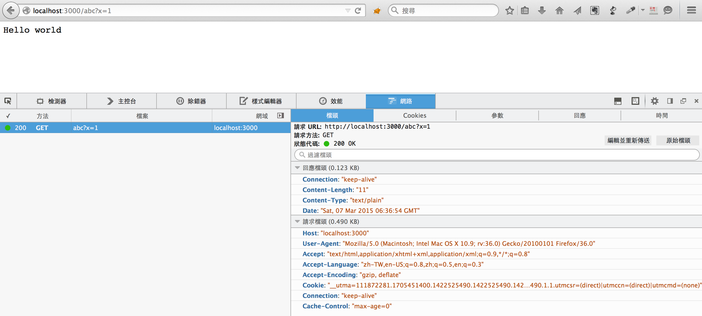
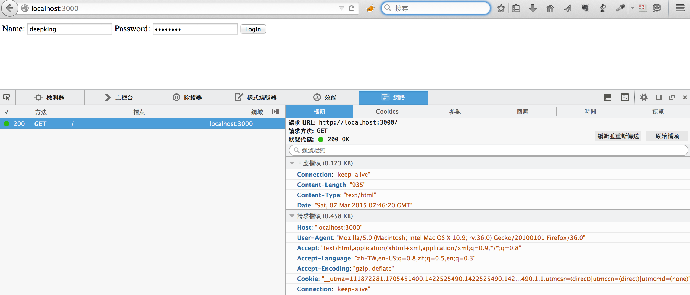
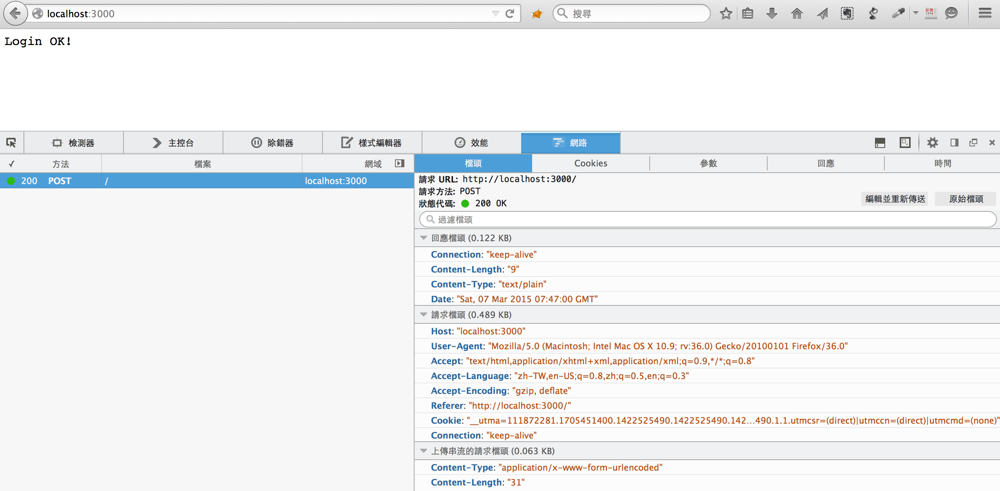

# node

# tutorial
- [CodeSchool](http://campus.codeschool.com/courses/real-time-web-with-node-js)

# HTTP
Browser 與 Server 溝通方式(Protocol).

Browser 送出 HTTP Request, Server 回應 HTTP Response。

## HTTP Request 
可以分成多種 [Method](http://devdocs.io/http-request-methods/), Browser 只能送出兩種
- GET 用來跟 Server 要資料 Show 在 Browser, Server 由 Url
  決定回應什麼資料
- POST 用來上傳資料，例如: Login, 上傳 File

## HTTP Response
Server 回應 Browser, 會有個欄位 [Status Code](http://devdocs.io/http-response-status-codes/)
- 200 OK
- 404 Not Found
- 500 Internal Server Error

並且帶 Content 給 Browser 顯示，例如 HTML。

# Example 1

執行 [src/node/ex1_http/server.js](src/node/ex1_http/server.js)
```
$ node server.js
Listening on port 3000
```
用 Browser 開發者模式，並 open url: http://localhost:3000/abc?x=1

看 Server log, 與 Browser 請求檔頭(HTTP Request), 回應檔頭(HTTP
Response)



# Example 2

執行 [src/node/ex2_http/server.js](src/node/ex2_http/server.js)
```
$ node server.js
```

open url: http://localhost:3000



click login



server.log
```
==========================================
method GET

==========================================
method POST
name=deepking&password=55665566
deepking 55665566
```
